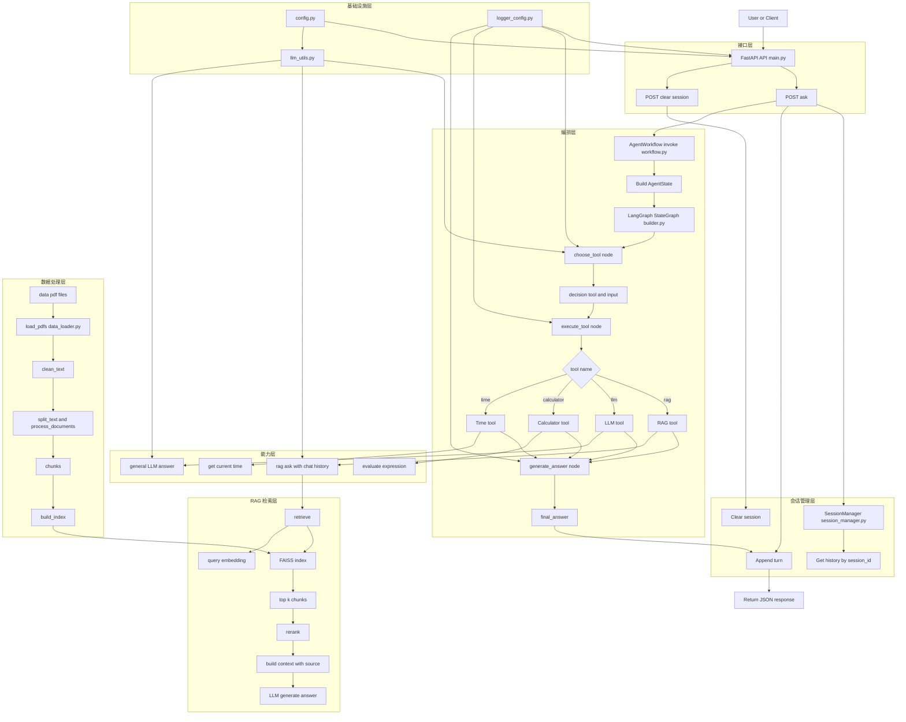

# Paper RAG Agent with LangGraph

一个面向 **科研论文检索、问答与辅助分析** 的 RAG Agent 工程实践项目。  
项目基于 **Python 3.11** 构建，当前版本使用 **FastAPI + FAISS + OpenAI-compatible API + LangGraph**，支持论文 PDF 加载、文本切分、向量检索、RAG 问答、多轮对话、工具调用，以及基于状态图的 Agent 编排。

这个项目的目标不是只做一个“能跑的 RAG Demo”，而是逐步搭建一个 **可运行、可解释、可展示、可扩展** 的论文分析系统，并为后续的 **Dify / MCP / Web 产品化** 打基础。

该系统采用“接口层 + 会话管理层 + LangGraph 编排层 + 工具层 + RAG 检索层 + 数据处理层”的结构。
用户请求首先通过 FastAPI 进入系统，结合 session_id 获取历史对话后，交由 LangGraph 编排层处理。编排层基于状态对象 AgentState 串联 choose_tool、execute_tool 和 generate_answer 三个节点，实现工具选择、工具执行和结果汇总。对于文档类问题，系统会进一步调用 RAG 模块完成向量检索、重排序和基于上下文的回答生成；对于通用问题，则调用 LLM 或其他工具完成响应。整个系统支持多轮对话、工具扩展和后续更复杂 Agent 工作流的继续演进。
---


## 1. Project Overview

在科研和论文写作过程中，研究者往往需要频繁查找、理解和回溯大量参考文献。  
例如，当某个研究想法需要理论支撑时，常常需要快速定位：

- 某个论点最早出自哪篇论文
- 某种方法的研究动机是什么
- 某篇参考文献解决了什么问题
- 某个公式、实验或结论具体是如何提出的

随着文献数量增加，研究者很容易遗忘论文的核心内容和出处，导致检索、回顾和整理成本越来越高。

基于此，本项目尝试构建一个面向科研场景的 **论文 RAG 问答与分析系统**，用于辅助完成：

- 文献检索
- 论文问答
- 多轮追问
- 知识回溯
- 简单工具辅助分析

从而提升文献利用效率，减少重复查找时间。

---

## 2. Why Not Just a Simple RAG

基础 RAG 可以完成“检索相关片段并生成回答”的任务，但在真实科研场景中往往还不够。

一方面，研究者的问题并不总是单轮的。很多时候需要围绕同一篇论文持续追问，例如：

- 论文背景是什么
- 研究问题是什么
- 方法设计有什么特点
- 实验结论是什么
- 某个公式或概念该如何理解

另一方面，部分任务还需要结合额外工具，例如：

- 时间查询
- 简单计算
- 通用问答
- 文档检索

因此，项目不只停留在单轮检索问答，而是进一步引入了：

- 多轮对话
- Tool Calling
- LangGraph 工作流编排
- Session 级状态管理

使系统能够更贴近真实的科研辅助使用场景。

---

## 3. Why LangGraph

在前期版本中，系统已经通过手写方式实现了基础的 RAG、工具选择、工具执行和结果返回流程，能够完成一个简化的 Agent 雏形。

但随着功能逐渐增多，若继续依赖手写串联逻辑，编排层会越来越复杂，工具扩展、节点维护和状态管理的成本也会逐步升高。

引入 LangGraph 的目的，是将原本分散的执行逻辑进一步 **节点化、状态化、流程化**，把工具选择、工具执行、结果生成等步骤整理为更清晰的工作流结构。这样做有助于提升系统的：

- 可维护性
- 可扩展性
- 工程展示性

也更适合后续承接更复杂的 Agent 场景。

---

## 4. Current Features

当前版本已实现或已基本具备以下能力：

- 支持加载 `data/` 目录下的 PDF 文档
- 对文档文本进行清洗与切分
- 使用 Embedding 模型构建向量索引
- 基于 FAISS 进行向量检索
- 对检索结果进行简单 rerank
- 基于检索上下文完成 RAG 问答
- 支持多轮对话历史注入
- 支持基于 `session_id` 的会话隔离
- 支持 `rag / calculator / time / llm` 四类工具
- 使用 LangGraph 构建 Agent 工作流
- 提供 FastAPI 接口用于服务化调用
- 提供基础日志记录与异常兜底

---

## 5. Tech Stack

本项目当前使用的主要技术如下：

- **Python 3.11**
- **FastAPI**
- **LangGraph**
- **FAISS**
- **PyPDF**
- **OpenAI-compatible API**
- **DeepSeek Chat Model**
- **text-embedding-3-small**
- **dotenv**
- **Git / GitHub**

当前实现中使用的模型配置示例：

- Chat Model: `deepseek-chat`
- Embedding Model: `text-embedding-3-small`

你也可以通过 `.env` 文件替换为其他 OpenAI-compatible 服务。

---

## 6. Project Structure

当前项目更贴近下面这种结构：

```text
project-root/
├── app/
│   ├── config.py
│   ├── data_loader.py
│   ├── llm_utils.py
│   ├── logger_config.py
│   ├── rag_system.py
│   ├── session_manager.py
│   ├── tools.py
│   ├── main.py
│   └── graph/
│       ├── builder.py
│       ├── nodes.py
│       ├── state.py
│       └── workflow.py
├── data/
│   └── *.pdf
├── requirements.txt
├── README.md
├── .env
└── .gitignore
```

其中：

- `main.py`：FastAPI 服务入口
- `rag_system.py`：RAG 检索、rerank、问答核心逻辑
- `tools.py`：工具定义
- `session_manager.py`：按 `session_id` 管理历史对话
- `graph/`：LangGraph 编排层实现
- `data_loader.py`：PDF 加载、清洗、切分

---

## 7. Workflow

当前版本的核心工作流如下：

```text
User Question
    ↓
Session History
    ↓
LangGraph Workflow
    ↓
choose_tool
    ↓
execute_tool
    ↓
generate_answer
    ↓
Final Answer
```

如果所选工具为 `rag`，则内部流程进一步为：

```text
Question
    ↓
Embedding
    ↓
FAISS Retrieval
    ↓
Rerank
    ↓
Context Assembly
    ↓
LLM Answer
```

---

## 8. LangGraph State Design

当前 `AgentState` 主要包含以下字段：

- `session_id`：当前会话 ID
- `query`：当前用户问题
- `chat_history`：历史对话
- `decision`：路由决策结果
- `tool_result`：工具执行结果
- `final_answer`：最终返回答案
- `error`：异常信息

这种设计使得整个工作流中的中间结果都可以显式传递和管理，方便后续扩展更复杂的节点逻辑。

---

## 9. Built-in Tools

当前系统内置工具如下：

### 1) rag
用于论文 / 文档相关问题的检索增强回答。

### 2) calculator
用于简单数学表达式计算。未来用于处理一些论文的公式

### 3) time
用于返回当前时间。未来考虑设计用于查询文献的发布时间。

### 4) llm
用于一般性问题回答。

---

## 10. Session Memory

项目当前已支持基于 `session_id` 的多轮会话隔离。

实现方式为：

- 每个 `session_id` 单独维护一份历史对话
- 每轮对话保存 user / assistant 两条消息
- 默认最多保留最近 3 轮对话
- 支持手动清空某个 session

这使得系统能够处理更贴近真实场景的连续追问，而不是仅支持单轮问答。

---

## 11. API Endpoints

### POST `/ask`

请求示例：

```json
{
  "session_id": "demo-session",
  "question": "What is the main contribution of this paper?"
}
```

返回示例：

```json
{
  "session_id": "demo-session",
  "question": "What is the main contribution of this paper?",
  "answer": "..."
}
```

### POST `/clear/{session_id}`

用于清空指定会话的历史记录。

---

## 12. Quick Start

### 12.1 Clone the Repository

```bash
git https://github.com/1186141415/LangChain-for-A-Paper-Rag-Agent.git
cd LangChain-for-A-Paper-Rag-Agent
```

### 12.2 Create Virtual Environment

Windows:

```bash
python -m venv .venv
.venv\Scripts\activate
```

Linux / macOS:

```bash
python3.11 -m venv .venv
source .venv/bin/activate
```

### 12.3 Install Dependencies

```bash
pip install -r requirements.txt
```

### 12.4 Configure Environment Variables

在项目根目录创建 `.env` 文件：

```env
DEEPSEEK_API_KEY=your_deepseek_api_key
DEEPSEEK_BASE_URL=https://api.deepseek.com

EMBEDDING_API_KEY=your_embedding_api_key
EMBEDDING_BASE_URL=your_embedding_base_url

CHAT_MODEL=deepseek-chat
EMBEDDING_MODEL=text-embedding-3-small

DATA_DIR=data
```

### 12.5 Prepare Data

将待处理论文 PDF 放入 `data/` 目录，例如：

```text
data/
├── paper1.pdf
├── paper2.pdf
└── paper3.pdf
```

### 12.6 Run the Service

```bash
uvicorn app.main:app --reload
```

启动后可访问：

```text
http://127.0.0.1:8000/docs
```

查看自动生成的接口文档。

---

## 13. Example Use Cases

典型问题示例：

```text
What is the main contribution of this paper?
```

```text
What problem does this paper try to solve?
```

```text
What is the difference between this method and previous work?
```

```text
Can you explain the formula in Section 3?
```

```text
What time is it now?
```

```text
2 * (3 + 5)
```

这些问题分别可以触发：

- 文档检索问答
- 多轮文献追问
- 通用问答
- 时间工具
- 计算工具

---

## 14. Current Engineering Value

这个项目当前想体现的，不是“会调用一个大模型 API”，而是：

- 理解 RAG 的完整闭环
- 能把 PDF 文档问答做成可运行服务
- 能实现基础的多轮会话管理
- 能将 RAG 与 Tool Calling 结合
- 能用 LangGraph 对 Agent 流程进行结构化编排
- 能把项目整理成可展示、可讲解、可扩展的工程原型

对于 RAG / Agent / AI 应用开发方向的学习和求职来说，这比单纯堆功能更重要。

---

## 15. Future Work

后续计划可以继续扩展的方向包括：

- [ ] 支持多论文对比分析
- [ ] 优化 prompt 与工具路由策略
- [ ] 增加更丰富的工具类型
- [ ] 接入 Dify 进行工作流原型验证
- [ ] 接入 MCP 或其他外部能力服务
- [ ] 封装固定科研任务能力模块
- [ ] 增加文献要点提炼与综述提纲生成功能
- [ ] 增加更完整的日志、评测与配置管理
- [ ] 接入前端或 Django 做成可展示的 Web 产品

---

## 16. Notes

- 当前版本强调的是 **工程化闭环**，而不是一次性做完所有能力
- README 内容以当前真实实现为准，后续随着功能扩展会持续更新
- 如果后续加入 Dify / MCP / skills 等能力，建议继续拆分模块并补充架构图

---

## 17. License

This project is for learning, experimentation, and engineering practice.