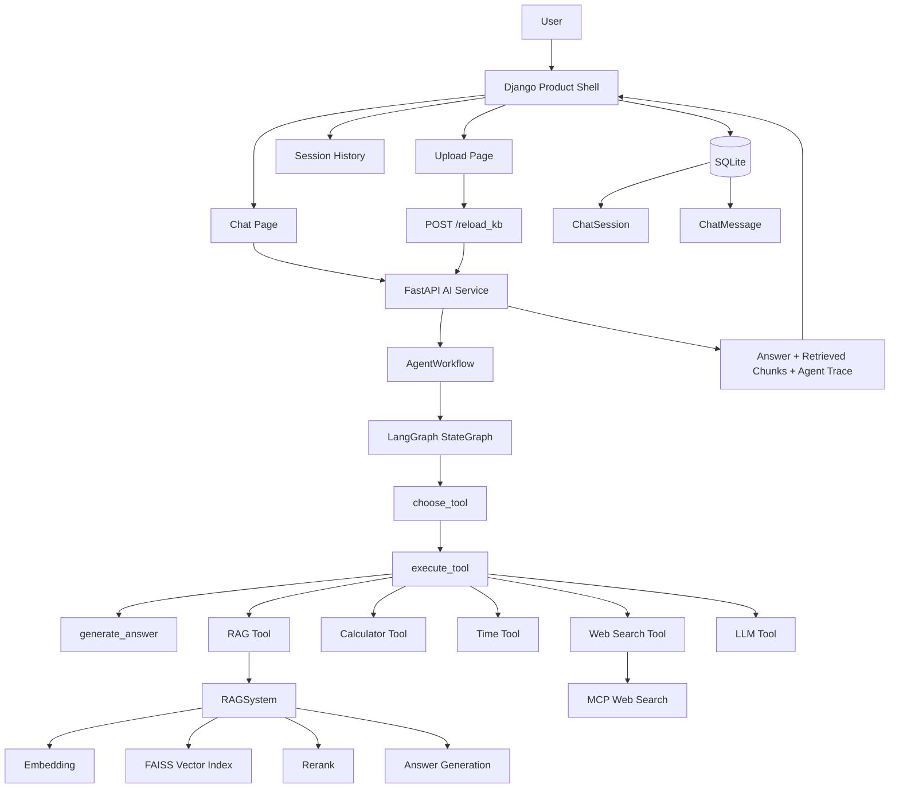

# Paper RAG Agent with LangGraph

一个面向 **科研论文阅读、检索问答与辅助分析** 的 AI 应用工程项目。

项目以 **RAG 检索增强问答** 为核心能力，使用 **FastAPI** 提供 AI 推理服务，使用 **LangGraph** 编排 Agent 工具调用流程，并通过 **Django** 构建产品壳层，实现论文上传、知识库更新、聊天问答、历史会话保存、检索片段展示和 Agent Trace 展示。

当前版本已经形成一个完整的最小产品闭环：

```text
上传论文 -> 重建知识库 -> 发起问答 -> Agent 选择工具 -> RAG 检索回答 -> 展示检索片段 -> 保存历史会话
```

项目目标不是构建大而全的 SaaS 平台，而是围绕 **论文检索 + Agent 编排 + Web 产品化展示** 构建一个结构清晰、可运行、可解释、适合简历和面试讲解的 AI 应用工程样例。

---

## 1. Project Overview

在科研和论文写作过程中，研究者往往需要频繁查找、理解和回溯大量参考文献。

例如，当某个研究想法需要理论支撑时，常常需要快速定位：

- 某个论点最早出自哪篇论文
- 某种方法的研究动机是什么
- 某篇参考文献解决了什么问题
- 某个公式、实验或结论具体是如何提出的
- 多篇论文之间的研究思路和方法差异是什么

随着文献数量增加，研究者容易遗忘论文的核心内容和出处，导致检索、回顾和整理成本越来越高。

基于此，本项目尝试构建一个面向科研场景的论文 RAG 问答与分析系统，用于辅助完成：

- 论文内容检索
- 文献问答
- 多轮追问
- 多论文对比
- 知识回溯
- 工具辅助分析

当前版本已经从最初的 RAG 后端原型，逐步扩展为一个包含 **AI 推理服务层、Agent 编排层、工具层、RAG 检索层和 Django 产品壳层** 的 AI 应用工程项目。

---

## 2. Project Positioning

本项目不是单纯调用大模型 API 的聊天 Demo，也不是只完成一次向量检索的 RAG 脚本。

项目重点在于构建一个相对完整的 AI 应用工程闭环：

```text
PDF 文档输入
    ↓
文本清洗与切分
    ↓
Embedding 向量化
    ↓
FAISS 向量检索
    ↓
Rerank 重排序
    ↓
LangGraph Agent 工具编排
    ↓
FastAPI 推理服务
    ↓
Django 产品壳层展示
    ↓
会话与消息持久化
```

整体设计遵循以下原则：

- 不推倒重来
- 不把核心 RAG / Agent / LangGraph 逻辑重写进 Django
- FastAPI 保持 AI 推理服务层定位
- LangGraph 负责编排 Agent 工具调用流程
- Django 只作为产品壳层、展示层和业务持久化层
- 不做复杂 SaaS、多租户、权限系统和重前端框架
- 优先服务于项目展示、简历表达和面试讲解

---

## 3. Current Features

当前版本已实现以下能力。

### 3.1 RAG 能力

- 支持加载 `data/` 目录下的 PDF 文档
- 支持文本清洗、切分与 chunk 构建
- 使用 Embedding 模型构建向量表示
- 基于 FAISS 进行向量检索
- 对初步检索结果进行 rerank
- 基于检索上下文生成回答
- 支持返回检索命中的 Top-K 文档片段
- 支持在页面展示 Retrieved Context，提升回答可解释性

### 3.2 Agent / LangGraph 能力

- 使用 LangGraph 构建 Agent 工作流
- 将 Agent 流程拆分为：

```text
choose_tool -> execute_tool -> generate_answer
```

- 使用 `AgentState` 显式传递中间状态
- 支持 `decision`、`tool_result`、`retrieved_chunks`、`final_answer` 等状态字段
- 支持返回 Agent Trace，包括工具选择、工具输入和工作流路径
- 页面可展示本轮问答使用的工具和执行路径

### 3.3 工具调用能力

当前系统内置以下工具：

- `rag`：用于论文 / 文档相关问题的检索增强回答
- `calculator`：用于简单数学表达式计算
- `time`：用于当前时间查询
- `web_search`：用于外部网页搜索
- `llm`：用于一般性问题回答

其中 `web_search` 通过 MCP 接入外部搜索能力，用于处理本地知识库无法覆盖或需要最新信息的问题。

### 3.4 FastAPI 推理服务

FastAPI 作为 AI 推理服务层，当前提供：

- `/ask`：执行一次 Agent 问答流程
- `/clear/{session_id}`：清空指定会话的短期上下文
- `/reload_kb`：重新加载本地知识库并重建 AgentWorkflow

FastAPI 负责连接 RAGSystem、LangGraph Workflow、工具层和会话管理逻辑。

### 3.5 Django 产品壳层

Django 当前作为产品壳层，负责：

- 提供聊天页面
- 提供 PDF 上传页面
- 提供历史会话列表
- 提供单个会话详情页
- 调用 FastAPI `/ask` 接口完成问答
- 调用 FastAPI `/reload_kb` 接口触发知识库重建
- 使用 SQLite 保存 `ChatSession` 和 `ChatMessage`
- 在页面展示回答结果、Retrieved Context 和 Agent Trace

---

## 4. System Architecture

项目采用分层结构，将 AI 推理能力和 Web 产品壳层分开：

- **Django Product Shell**：负责页面、上传入口、历史会话和展示层
- **FastAPI AI Service**：负责对外提供 AI 推理接口
- **LangGraph Workflow**：负责编排 Agent 工具调用流程
- **Tools Layer**：统一封装 RAG、LLM、计算器、时间查询和 Web Search
- **RAGSystem**：负责论文检索、rerank 和基于上下文的回答生成
- **SQLite**：保存聊天会话和消息记录



---

## 5. Core Workflow

### 5.1 论文上传与知识库更新流程

```text
User Upload PDF
    ↓
Django Upload Page
    ↓
Save PDF to data/
    ↓
Call FastAPI /reload_kb
    ↓
Load PDFs
    ↓
Clean and Split Documents
    ↓
Build Embeddings
    ↓
Build FAISS Index
    ↓
Rebuild RAGSystem
    ↓
Rebuild AgentWorkflow
```

说明：

1. 用户在 Django 上传页面提交 PDF 文件
2. Django 将 PDF 保存到本地 `data/` 目录
3. Django 调用 FastAPI 的 `/reload_kb` 接口
4. FastAPI 重新加载 `data/` 目录下的论文文件
5. 系统重新进行文本切分、向量化和 FAISS 索引构建
6. FastAPI 同步重建 AgentWorkflow，使后续问答使用新的知识库

### 5.2 问答与 Agent 编排流程

```text
User Question
    ↓
Django Chat Page
    ↓
FastAPI /ask
    ↓
AgentWorkflow
    ↓
choose_tool
    ↓
execute_tool
    ↓
generate_answer
    ↓
Answer + Retrieved Chunks + Agent Trace
    ↓
Django Page Display
    ↓
Save ChatSession / ChatMessage
```

说明：

1. 用户在 Django 聊天页面输入问题
2. Django 调用 FastAPI 的 `/ask` 接口
3. FastAPI 将 `session_id`、`question` 和历史对话传入 AgentWorkflow
4. LangGraph 依次执行 `choose_tool`、`execute_tool`、`generate_answer`
5. Agent 根据问题类型选择 `rag`、`calculator`、`time`、`web_search` 或 `llm`
6. 如果选择 RAG 工具，系统执行向量检索、rerank 和上下文增强回答
7. FastAPI 返回 `answer`、`retrieved_chunks` 和 `agent_trace`
8. Django 保存会话消息，并在页面展示回答、检索片段和 Agent 执行路径

### 5.3 RAG 内部流程

```text
Question
    ↓
Question Embedding
    ↓
FAISS Retrieval
    ↓
Rerank
    ↓
Context Assembly
    ↓
LLM Answer Generation
    ↓
Answer + Retrieved Chunks
```

---

## 6. Demo Pages

当前 Django 产品壳层包含以下页面。

### 6.1 Chat Page

聊天页面支持：

- 输入 session_id 和问题
- 展示多轮对话消息
- 展示 Recent Sessions
- 展示 Agent Trace
- 展示 Retrieved Context

建议截图位置：

```text
docs/images/chat_page.png
```

### 6.2 Upload Page

上传页面支持：

- 查看当前知识库 PDF 文件
- 上传新论文 PDF
- 上传后触发 FastAPI `/reload_kb`
- 重建本地知识库和 AgentWorkflow

建议截图位置：

```text
docs/images/upload_page.png
```

### 6.3 Session History Page

历史会话页面支持：

- 查看全部历史 session
- 进入单个 session 详情页
- 回溯历史问答内容

建议截图位置：

```text
docs/images/session_history.png
```

---

## 7. Tech Stack

当前项目使用的主要技术如下：

### Backend / AI Service

- Python 3.11
- FastAPI
- LangGraph
- FAISS
- PyPDF
- OpenAI-compatible API
- DeepSeek Chat Model
- text-embedding-3-small

### Agent / Tools

- LangGraph StateGraph
- Tool Calling
- MCP
- Zhipu MCP Web Search
- langchain-mcp-adapters

### Product Shell

- Django
- SQLite
- Django Templates
- requests

### Engineering

- dotenv
- logging
- Git / GitHub
- smoke tests

当前模型配置示例：

- Chat Model: `deepseek-chat`
- Embedding Model: `text-embedding-3-small`

可以通过 `.env` 文件替换为其他 OpenAI-compatible 服务。

---

## 8. Project Structure

```text
Paper-RAG-Agent-with-LangGraph/
├─ app/                                # 核心 RAG + LangGraph + FastAPI 代码
│  ├─ main.py                          # FastAPI 服务入口，暴露 /ask、/clear、/reload_kb
│  ├─ config.py                        # 读取 .env，集中管理模型、API、数据目录等配置
│  ├─ data_loader.py                   # 加载 PDF/TXT、清洗文本、切块
│  ├─ llm_utils.py                     # 初始化模型客户端，提供 embedding 和工具路由能力
│  ├─ logger_config.py                 # 日志配置
│  ├─ rag_system.py                    # RAG 核心：建索引、检索、rerank、生成回答
│  ├─ session_manager.py               # FastAPI 侧基于 session_id 管理短期多轮上下文
│  ├─ tools.py                         # Agent 工具定义：rag、calculator、time、web_search、llm
│  ├─ mcp_tools.py                     # MCP Web Search 工具封装
│  └─ graph/                           # LangGraph 编排层
│     ├─ builder.py                    # 构建 StateGraph
│     ├─ nodes.py                      # choose_tool、execute_tool、generate_answer 节点
│     ├─ state.py                      # AgentState 状态结构
│     └─ workflow.py                   # AgentWorkflow 封装
├─ data/                               # 本地论文知识库目录
│  ├─ Paper1.pdf
│  ├─ Paper2.pdf
│  └─ Paper3.pdf
├─ django_shell/                       # Django 产品壳层
│  ├─ manage.py
│  ├─ db.sqlite3
│  ├─ chat/                            # 聊天页面与历史会话
│  │  ├─ models.py                     # ChatSession / ChatMessage
│  │  ├─ views.py                      # 调用 FastAPI 并保存消息
│  │  ├─ urls.py
│  │  └─ services/
│  │     └─ ai_client.py               # 请求 FastAPI /ask
│  ├─ documents/                       # 文档上传应用
│  │  ├─ views.py                      # 上传 PDF 并调用 /reload_kb
│  │  └─ urls.py
│  ├─ config/                          # Django 项目配置
│  └─ templates/                       # 页面模板
│     ├─ chat/
│     │  ├─ chat_home.html
│     │  ├─ session_list.html
│     │  └─ session_detail.html
│     └─ documents/
│        └─ upload.html
├─ tests/                              # 冒烟测试脚本
│  ├─ smoke_test_graph.py
│  ├─ smoke_test_imports.py
│  ├─ smoke_test_mcp_call.py
│  ├─ smoke_test_mcp_zhipu.py
│  ├─ smoke_test_nodes.py
│  ├─ smoke_test_rag_trace.py
│  ├─ smoke_test_state.py
│  ├─ smoke_test_tools_with_mcp.py
│  └─ smoke_test_web_search_tool.py
├─ requirements.txt
└─ README.md
```

---

## 9. API Endpoints

### 9.1 POST `/ask`

用于执行一次 Agent 问答流程。

请求示例：

```json
{
  "session_id": "demo-session",
  "question": "What is the difference between paper1 and paper2?"
}
```

返回示例：

```json
{
  "session_id": "demo-session",
  "question": "What is the difference between paper1 and paper2?",
  "answer": "...",
  "chunks": [
    {
      "source": "Paper1.pdf",
      "text": "..."
    }
  ],
  "agent_trace": {
    "route_decision": {
      "tool": "rag",
      "input": "What is the difference between paper1 and paper2?"
    },
    "tool_used": "rag",
    "tool_input": "What is the difference between paper1 and paper2?",
    "workflow": [
      "choose_tool",
      "execute_tool",
      "generate_answer"
    ]
  }
}
```

### 9.2 POST `/reload_kb`

用于重新加载 `data/` 目录下的论文文件，并重建知识库和 AgentWorkflow。

返回示例：

```json
{
  "status": "success",
  "message": "Knowledge base reloaded. Total chunks: 120",
  "total_docs": 3,
  "total_chunks": 120
}
```

### 9.3 POST `/clear/{session_id}`

用于清空 FastAPI 侧指定 session 的短期对话历史。

返回示例：

```json
{
  "session_id": "demo-session",
  "message": "session cleared"
}
```

---

## 10. Quick Start

### 10.1 Clone the Repository

```bash
git clone https://github.com/1186141415/Paper-RAG-Agent-with-LangGraph.git
cd Paper-RAG-Agent-with-LangGraph
```

### 10.2 Create Virtual Environment

Windows:

```bash
python -m venv .venv
.venv\Scripts\activate
```

Linux / macOS:

```bash
python3.11 -m venv .venv
source .venv/bin/activate
```

### 10.3 Install Dependencies

```bash
pip install -r requirements.txt
```

### 10.4 Configure Environment Variables

在项目根目录创建 `.env` 文件：

```env
DEEPSEEK_API_KEY=your_deepseek_api_key
DEEPSEEK_BASE_URL=https://api.deepseek.com

EMBEDDING_API_KEY=your_embedding_api_key
EMBEDDING_BASE_URL=your_embedding_base_url

CHAT_MODEL=deepseek-chat
EMBEDDING_MODEL=text-embedding-3-small

DATA_DIR=data

ZHIPU_API_KEY=your_zhipu_api_key
MCP_SEARCH_URL=https://open.bigmodel.cn/api/mcp/web_search_prime/mcp
MCP_SEARCH_RECENCY=oneMonth
MCP_SEARCH_CONTENT_SIZE=medium
MCP_SEARCH_LOCATION=us
```

### 10.5 Prepare Papers

将论文 PDF 放入 `data/` 目录：

```text
data/
├─ Paper1.pdf
├─ Paper2.pdf
└─ Paper3.pdf
```

### 10.6 Start FastAPI AI Service

在项目根目录运行：

```bash
uvicorn app.main:app --reload
```

FastAPI 文档地址：

```text
http://127.0.0.1:8000/docs
```

### 10.7 Start Django Product Shell

另开一个终端：

```bash
cd django_shell
python manage.py runserver 8001
```

Django 页面地址：

```text
http://127.0.0.1:8001/
```

常用页面：

```text
Chat Home:        http://127.0.0.1:8001/
Upload Papers:   http://127.0.0.1:8001/documents/upload/
Session History: http://127.0.0.1:8001/sessions/
```

---

## 11. Startup Self-Check

启动服务后，可以按下面顺序做最小自检。

### 11.1 打开 FastAPI 接口文档

访问：

```text
http://127.0.0.1:8000/docs
```

如果能正常打开，说明 FastAPI 服务已成功启动。

### 11.2 打开 Django 页面

访问：

```text
http://127.0.0.1:8001/
```

如果能正常打开聊天页面，说明 Django 产品壳层已成功启动。

### 11.3 测试 RAG 问答

在 Django Chat 页面输入：

```text
What is the difference between paper1 and paper2?
```

预期现象：

- 页面返回回答
- Agent Trace 中显示 `Tool Used: rag`
- Retrieved Context 中展示命中的论文片段
- Conversation 中保存本轮问答

### 11.4 测试上传与知识库重建

访问：

```text
http://127.0.0.1:8001/documents/upload/
```

上传 PDF 后，预期现象：

- 页面显示当前知识库文件
- FastAPI 控制台出现 reload 日志
- `/reload_kb` 重新加载 PDF、重新切分、重新构建索引
- AgentWorkflow 同步更新

### 11.5 测试计算工具

向 `/ask` 发送：

```json
{
  "session_id": "smoke-calc",
  "question": "Calculate 123 * 45"
}
```

预期返回结果包含：

```text
5535
```

### 11.6 测试普通 LLM 路由

向 `/ask` 发送：

```json
{
  "session_id": "smoke-llm",
  "question": "Write one sentence to encourage me."
}
```

预期现象：

- 路由到 `llm`
- `input` 保持原问题
- 返回通用回答

### 11.7 测试 MCP 外部搜索工具

向 `/ask` 发送：

```json
{
  "session_id": "smoke-web",
  "question": "Search the web for the latest AI agent engineering trends."
}
```

预期现象：

- 路由到 `web_search`
- 系统通过 MCP 调用外部网页搜索能力
- 返回若干条网页搜索结果

---

## 12. Example Use Cases

典型问题示例：

```text
What is the main contribution of this paper?
```

```text
What problem does this paper try to solve?
```

```text
What is the difference between paper1 and paper2?
```

```text
Can you explain the formula in Section 3?
```

```text
Search the web for recent progress about AI agents.
```

```text
What time is it now?
```

```text
Calculate 2 * (3 + 5)
```

这些问题分别可以触发：

- 文档检索问答
- 多轮文献追问
- 多论文对比
- 通用问答
- 时间工具
- 计算工具
- MCP 外部搜索工具

---

## 13. Engineering Highlights

这个项目当前想体现的，不是“会调用一个大模型 API”，而是一个 AI 应用从后端能力到产品展示的工程闭环。

### 13.1 分层清晰

项目将不同职责拆分到不同层：

- Django：产品壳层、页面展示、上传入口、历史会话持久化
- FastAPI：AI 推理服务接口
- LangGraph：Agent 工作流编排
- Tools：工具注册与调用
- RAGSystem：检索、rerank 和回答生成
- SQLite：会话和消息存储

### 13.2 Agent 流程可解释

系统不只返回最终回答，还能返回并展示：

- 本轮选择了哪个工具
- 工具输入是什么
- LangGraph 执行路径是什么
- RAG 检索到了哪些论文片段

这使得系统更适合调试、展示和面试讲解。

### 13.3 上传后动态更新知识库

Django 上传论文后，会调用 FastAPI `/reload_kb`，重新加载本地 PDF、切分文档、构建向量索引，并同步重建 AgentWorkflow。

这使系统具备了更接近真实产品的知识库更新能力。

### 13.4 保留核心 AI 能力的独立性

Django 只负责产品壳层，不侵入 RAG / Agent / LangGraph 核心逻辑。

这使项目结构更清晰，也方便后续替换前端、扩展工具或部署 AI 服务。

---

## 14. Future Work

后续优化方向主要围绕工程可用性和展示完整度展开，而不是扩展成复杂 SaaS 平台：

- [ ] 优化页面样式，使 Demo 截图更清晰
- [ ] 增加更细粒度的文档管理，例如删除文档、查看文档状态
- [ ] 增加轻量任务状态记录，例如上传时间、reload 结果、chunks 数量
- [ ] 优化工具路由 Prompt，提高 `rag / web_search / llm` 的选择稳定性
- [ ] 增加 RAG 评测脚本，记录不同 `top_k`、`rerank_k` 下的回答效果
- [ ] 支持更清晰的多论文对比问答
- [ ] 扩展更多 MCP 工具，例如学术搜索、文件系统或数据库查询
- [ ] 增加部署说明，例如本地双服务启动、反向代理或 Docker 化

---

## 15. Notes

- 当前版本强调的是工程化闭环，而不是一次性做完所有能力
- README 内容以当前真实实现为准，后续随着功能扩展持续更新
- 本项目主要用于学习、实践、展示和面试讲解
- 当前版本不优先实现复杂登录、多用户、多租户和权限系统

---

## 16. License

This project is for learning, experimentation, and engineering practice.