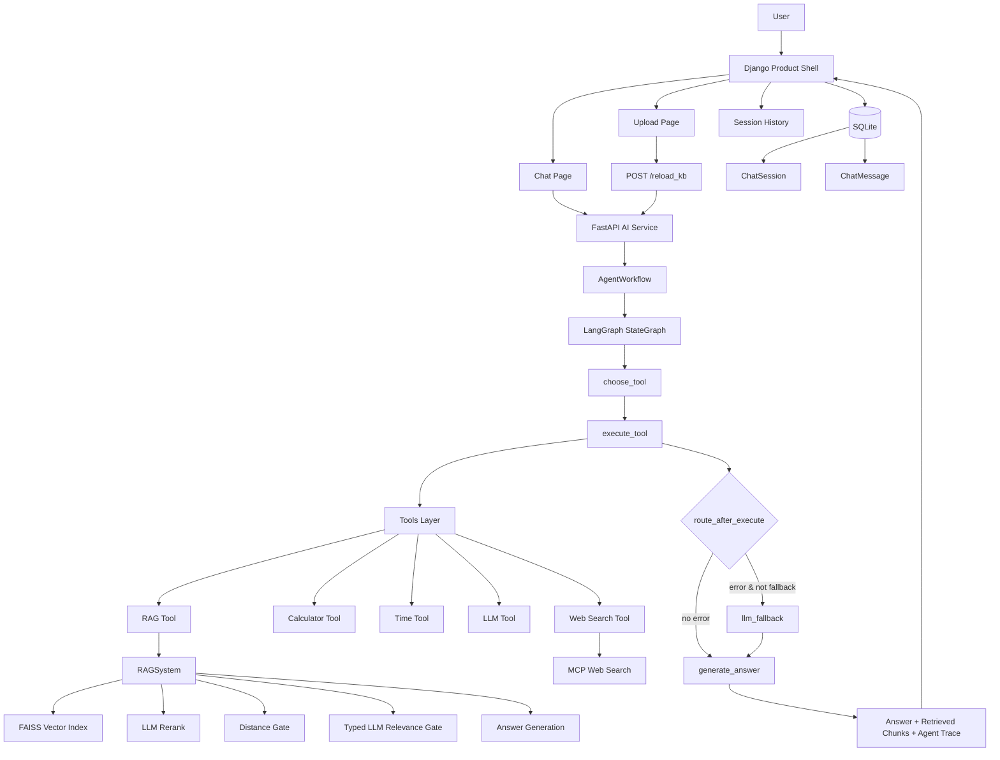
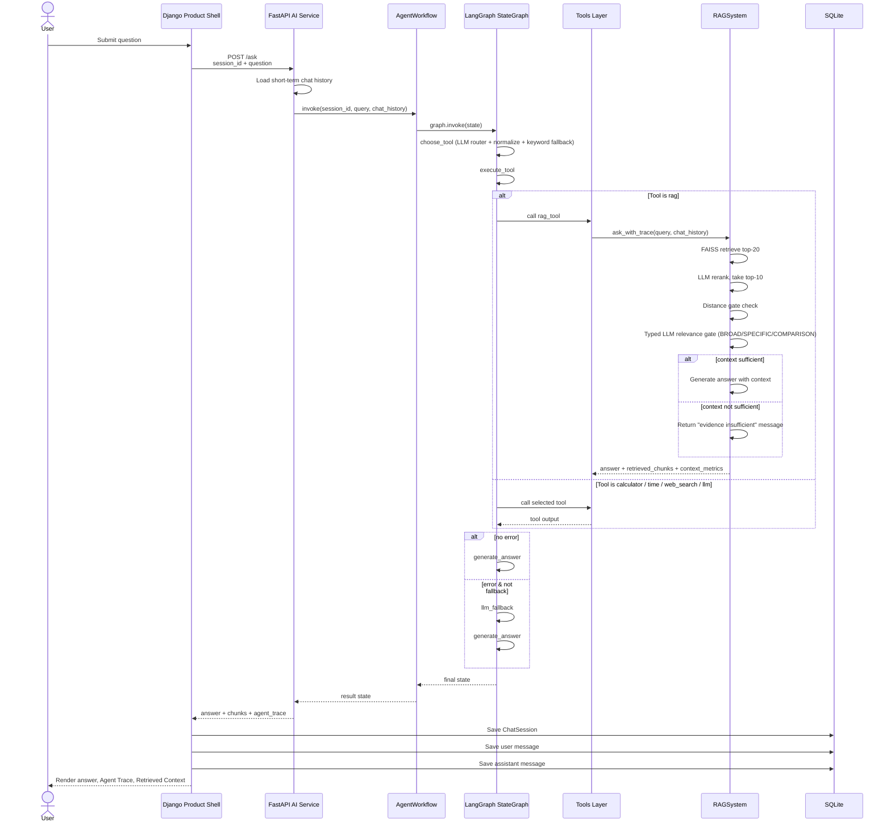
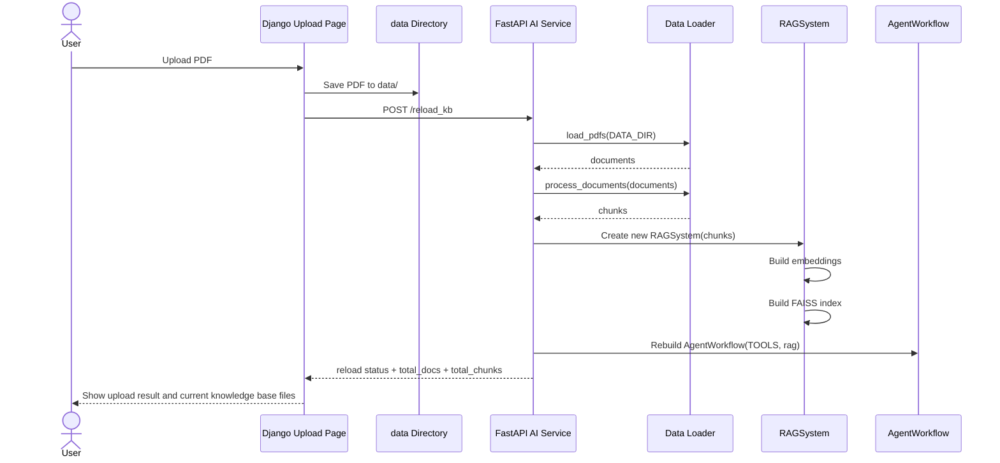
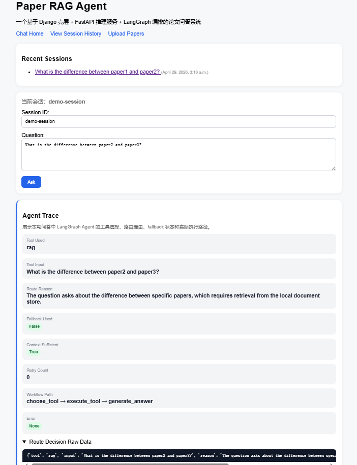
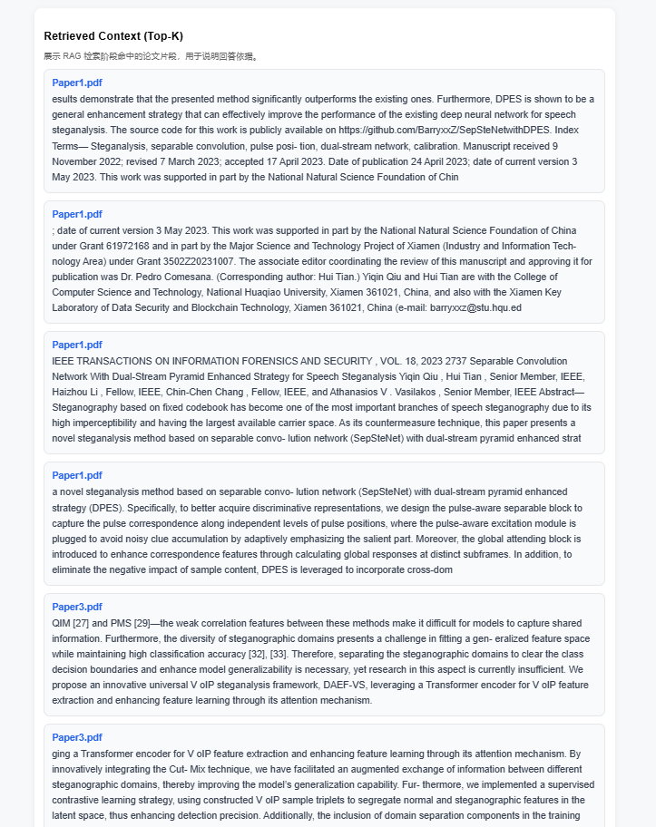

# Paper RAG Agent with LangGraph

一个面向 **科研论文阅读与文献知识回溯** 的轻量级 **RAG Agent 应用系统**。

项目以本地 PDF 论文知识库为基础,围绕论文内容检索、证据片段回溯、基于上下文的回答生成、工具路由、双层证据充分性检查和 Agent Trace 展示,构建一个可运行、可解释、可持续迭代的 AI 应用工程项目。

系统使用 **FastAPI** 封装 AI 推理服务,使用 **LangGraph** 编排 Agent 工具调用流程,并通过 **Django** 构建产品壳层,实现论文上传、知识库更新、聊天问答、历史会话保存、Retrieved Context 展示和 Agent Trace 展示。

当前版本已经形成一个完整的最小产品闭环:

```text
上传论文 -> 重建知识库 -> 发起问答 -> Agent 选择工具 -> RAG 检索 -> Rerank ->
双层证据充分性判断 -> 上下文生成回答 -> 展示检索片段 -> 展示 Agent Trace -> 保存历史会话
```

项目目标不是构建大而全的科研 SaaS 平台,而是围绕 **论文检索 + Agent 编排 + 证据充分性裁决 + Web 产品化展示 + 可解释执行过程** 构建一个结构清晰、可运行、可观察、可持续打磨的 AI 应用工程样例。

---

## 1. Project Overview

在科研和论文写作过程中,研究者往往需要频繁查找、理解和回溯大量参考文献。

例如,当某个研究想法需要理论支撑时,常常需要快速定位:

- 某个论点最早出自哪篇论文
- 某种方法的研究动机是什么
- 某篇参考文献解决了什么问题
- 某个公式、实验或结论具体是如何提出的
- 多篇论文之间的研究思路和方法差异是什么

随着文献数量增加,研究者容易遗忘论文的核心内容和出处,导致检索、回顾和整理成本越来越高。

基于此,本项目尝试构建一个面向科研场景的论文 RAG 问答与分析系统,用于辅助完成:

- 论文内容检索
- 文献问答
- 多轮追问
- 多论文对比
- 知识回溯
- 工具辅助分析

当前版本已经从最初的 RAG 后端原型,逐步扩展为一个包含 **AI 推理服务层、Agent 编排层、工具层、RAG 检索层(含双层证据充分性裁决) 和 Django 产品壳层** 的 AI 应用工程项目。

---

## 2. Project Positioning

本项目不是单纯调用大模型 API 的聊天 Demo,也不是只完成一次向量检索的 RAG 脚本。

项目重点在于构建一个相对完整的 AI 应用工程闭环:

```text
PDF 文档输入
    ↓
文本清洗与切分(700 字符 / 120 重叠)
    ↓
Embedding 向量化
    ↓
FAISS 向量检索(Top-K = 20)
    ↓
LLM Rerank 重排序(取 Top 10)
    ↓
FAISS 距离门 + 类型化 LLM 相关性门(双层证据充分性判断)
    ↓
LangGraph Agent 工具编排(条件分支 + fallback)
    ↓
FastAPI 推理服务
    ↓
Django 产品壳层展示
    ↓
会话与消息持久化
```

整体设计遵循以下原则:

- 不把核心 RAG / Agent / LangGraph 逻辑重写进 Django
- FastAPI 保持 AI 推理服务层定位
- LangGraph 负责编排 Agent 工具调用流程
- Django 只作为产品壳层、展示层和业务持久化层
- 不做复杂 SaaS、多租户、权限系统和重前端框架

---

## 3. Current Features

当前版本已实现以下能力。

### 3.1 RAG 能力

- 支持加载 `data/` 目录下的 PDF 文档
- 支持文本清洗、切分与 chunk 构建(默认 700 字符 / 120 重叠,针对英文论文调优)
- 使用 Embedding 模型构建向量表示,首次构建后缓存,避免重复消耗 API
- 基于 FAISS `IndexFlatL2` 进行向量检索,Top-K = 20
- 对初步检索结果使用 LLM rerank 重排,取前 10 进入后续流程
- Rerank 输出做 markdown 代码块剥离、bracket 列表抽取、去重补齐和 fallback trace,避免 LLM 输出格式不稳定影响系统可用性
- **双层证据充分性判断**:
  - 第一层:基于 FAISS 距离的轻量阈值规则(`best_distance` 与 `avg_top_distance`)
  - 第二层:类型化 LLM 相关性裁决,把问题归类为 `BROAD` / `SPECIFIC` / `COMPARISON`,按类型应用不同的判断标准
- 当证据不足时不强行生成回答,而是显式告知用户"证据不足",避免基于不相关片段编造内容
- 对 BROAD 类问题应用更宽松的策略:LLM 判 NO 时仅作为 soft warning,降级到距离门结果
- 命中片段附带 `source`、`distance`、`retrieval_rank` 返回前端用于证据展示

### 3.2 Agent / LangGraph 能力

当前系统使用 LangGraph 构建带有条件分支和 fallback 的轻量级 Agent Workflow:

```text
START
    ↓
choose_tool
    ↓
execute_tool
    ↓
route_after_execute(条件边)
    ├── 无错误 -> generate_answer -> END
    └── 有错误且未 fallback -> llm_fallback -> generate_answer -> END
```

当前 Agent / LangGraph 层已经支持:

- 使用 `AgentState`(TypedDict) 显式传递中间状态
- 使用 LLM Router 在运行时选择工具,返回 `tool` / `input` / `reason` 三段式 JSON
- 对 router 输出做格式校验和工具白名单约束(`normalize_decision`),非法工具自动降级到 `llm`
- 关键词兜底规则(`maybe_force_web_search`):当问题同时出现"最新 / latest / news"等联网信号且引用了本地文档时,强制路由到 `web_search`,避免 LLM 路由不稳定时给出错误判断
- 通过 `reason` 字段解释为什么选择某个工具
- 使用 LangGraph `add_conditional_edges` 实现条件边
- 工具执行失败后进入 `llm_fallback` 节点,使用历史对话直接由 LLM 兜底
- RAG 工具内部进行 `context_sufficient` 检查,若不充分会返回明确说明
- 使用 `fallback_used` 标记本轮是否触发兜底
- 使用 `retry_count` 为后续 Reflection / retry 机制预留状态
- 使用 `workflow_path` 记录每个节点的实际执行路径
- 返回并展示 Agent Trace,包括工具选择、路由理由、fallback 状态、上下文充分性、context_metrics 和 workflow path

当前 Agent 设计不是完整 autonomous Agent,也不是完整 ReAct 实现,而是一个面向论文阅读场景的轻量级 Tool Calling + RAG + LangGraph Workflow 应用雏形。

### 3.3 工具调用能力

当前系统内置以下工具:

- `rag`:用于论文 / 文档相关问题的检索增强回答(带双层证据充分性判断)
- `calculator`:基于 Python AST 的安全计算器,只放行 `+ - * /`、括号、数字和一元正负号,**不使用裸 `eval`**
- `time`:用于当前时间查询,未来计划设计成可以查询近期发表文献的工具
- `web_search`:用于外部网页搜索
- `llm`:用于一般性问题回答

其中 `web_search` 通过 MCP(智谱 `web_search_prime`) 接入外部搜索能力,用于处理本地知识库无法覆盖或需要最新信息的问题。MCP 返回结果做了双层 JSON 解析兜底,避免 text 字段被嵌套字符串包裹时无法正常解析。

### 3.4 FastAPI 推理服务

FastAPI 作为 AI 推理服务层,当前提供:

- `/ask`:执行一次 Agent 问答流程
- `/clear/{session_id}`:清空指定会话的短期上下文
- `/reload_kb`:重新加载本地知识库并重建 AgentWorkflow

FastAPI 负责连接 RAGSystem、LangGraph Workflow、工具层和会话管理逻辑。

### 3.5 Django 产品壳层

Django 当前作为产品壳层,负责:

- 提供聊天页面
- 提供 PDF 上传页面
- 提供历史会话列表
- 提供单个会话详情页
- 调用 FastAPI `/ask` 接口完成问答
- 调用 FastAPI `/reload_kb` 接口触发知识库重建
- 使用 SQLite 保存 `ChatSession` 和 `ChatMessage`
- 在页面展示回答结果、Retrieved Context 和 Agent Trace

---


## 4. System Architecture



项目采用分层结构,将 AI 推理能力和 Web 产品壳层分开:

- **Django Product Shell**:负责页面、上传入口、历史会话和展示层
- **FastAPI AI Service**:负责对外提供 AI 推理接口
- **LangGraph Workflow**:负责编排 Agent 工具调用流程,带条件分支和 fallback
- **Tools Layer**:统一封装 RAG、LLM、计算器、时间查询和 Web Search
- **RAGSystem**:负责论文检索、rerank、双层证据充分性判断和基于上下文的回答生成
- **SQLite**:保存聊天会话和消息记录

---

## 5. Request Sequence

### 5.1 Ask Question Sequence



### 5.2 Upload and Reload Knowledge Base Sequence



---

## 6. Core Workflow

### 6.1 论文上传与知识库更新流程

```text
User Upload PDF
    ↓
Django Upload Page
    ↓
Save PDF to data/
    ↓
Call FastAPI /reload_kb
    ↓
Load PDFs (PyPDF + clean_text)
    ↓
Split into chunks (700 chars / 120 overlap)
    ↓
Build Embeddings
    ↓
Build FAISS IndexFlatL2
    ↓
Rebuild RAGSystem
    ↓
Rebuild AgentWorkflow
```

### 6.2 问答与 Agent 编排流程

```text
User Question
    ↓
Django Chat Page
    ↓
FastAPI /ask
    ↓
AgentWorkflow.invoke
    ↓
choose_tool
    ├─ LLM Router 输出 JSON 决策
    ├─ normalize_decision (工具白名单 + 输入归一化)
    └─ maybe_force_web_search (关键词兜底)
    ↓
execute_tool
    ↓
route_after_execute
    ├── normal -> generate_answer
    └── error & not fallback_used -> llm_fallback -> generate_answer
    ↓
Answer + Retrieved Chunks + Agent Trace
    ↓
Django Page Display
    ↓
Save ChatSession / ChatMessage
```

### 6.3 RAG 内部流程

```text
Question
    ↓
Question Embedding
    ↓
FAISS Retrieval (Top-K = 20)
    ↓
LLM Rerank (取 Top 10,带 fallback 与 trace)
    ↓
┌─────────────────────────────────────────────────┐
│ Layer 1: Distance Gate (FAISS 距离门)           │
│   - num_chunks >= MIN_CONTEXT_CHUNKS            │
│   - best_distance <= 2.2                        │
│   - avg_top_distance <= 2.4                     │
└─────────────────────────────────────────────────┘
    ↓
┌─────────────────────────────────────────────────┐
│ Layer 2: Typed LLM Relevance Gate              │
│   - 先判 TYPE: BROAD / SPECIFIC / COMPARISON    │
│   - 再判 VERDICT: YES / NO                     │
│   - BROAD: 失败时降级为 soft warning            │
│   - SPECIFIC / COMPARISON: 失败硬阻断          │
└─────────────────────────────────────────────────┘
    ↓
context_sufficient?
    ├── True  -> Context Assembly -> LLM Answer Generation
    └── False -> 返回"证据不足"说明,不强行生成
    ↓
Answer + Retrieved Chunks + Context Metrics
```

---

## 7. Demo Pages

当前项目已经通过 Django 提供一个最小产品壳层,用于展示论文上传、问答交互、Agent Trace、RAG 检索片段和历史会话管理。

### 7.1 Upload Papers

Django 上传页面支持查看当前知识库文件,并上传新的 PDF。上传后,Django 会将文件保存到本地 `data/` 目录,并调用 FastAPI 的 `/reload_kb` 接口,触发知识库重建和 AgentWorkflow 更新。


### 7.2 Chat Page and Agent Trace

聊天页面支持用户输入 `session_id` 和问题,并展示最近会话、本轮回答、Agent Trace 和 Retrieved Context。

当前 Agent Trace 中可以看到:

- 本轮使用的工具
- 工具输入
- LLM Router 的选择理由
- 是否触发 fallback
- 当前 retrieved context 是否充分
- retry count
- LangGraph workflow path
- 原始 route decision 数据

这使系统不只展示最终回答,也能展示 Agent 在本轮问答中的执行过程,便于调试工具路由、观察 fallback 状态、解释证据充分性裁决,并向面试官解释 Agent Workflow 的运行路径。


### 7.3 Conversation Answer

系统会在页面中展示用户问题和 AI Assistant 的回答结果。Django 同时会将 user / assistant 消息保存到 SQLite 数据库中,方便后续回溯历史会话。


### 7.4 Retrieved Context

对于论文相关问题,系统会展示 RAG 检索阶段命中的 Top-K 论文片段,用于说明回答依据,避免系统表现成完全黑盒的聊天机器人。

Retrieved Context 中会展示:

- 命中的论文来源
- 相关文本片段
- 多个 Top-K 检索结果
- 支撑回答生成的上下文证据

这部分主要用于验证 RAG 检索是否命中正确论文内容,也为后续 RAG eval 提供人工观察依据。



### 7.5 Session History

Django 会将历史会话和消息保存到 SQLite 数据库中,并提供历史会话页面用于回溯不同 session 下的问答记录。


---

## 8. Tech Stack

当前项目使用的主要技术如下:

### Backend / AI Service

- Python 3.11
- FastAPI
- LangGraph
- FAISS
- PyPDF
- OpenAI-compatible API
- DeepSeek Chat Model
- text-embedding-3-small

### Agent / Tools

- LangGraph StateGraph + conditional edges
- Tool Calling (LLM Router + 工具白名单 + 关键词兜底)
- AST-based safe calculator (no `eval`)
- MCP
- Zhipu MCP `web_search_prime`
- langchain-mcp-adapters

### Product Shell

- Django
- SQLite
- Django Templates
- requests

### Engineering

- python-dotenv
- logging (统一 setup_logger)
- Git / GitHub
- smoke tests

当前模型配置示例:

- Chat Model: `deepseek-chat`
- Embedding Model: `text-embedding-3-small`

可以通过 `.env` 文件替换为其他 OpenAI-compatible 服务。

---

## 9. Project Structure

```text
Paper-RAG-Agent-with-LangGraph/
├─ app/                                # 核心 RAG + LangGraph + FastAPI 代码
│  ├─ main.py                          # FastAPI 服务入口,暴露 /ask、/clear、/reload_kb
│  ├─ config.py                        # 读取 .env,集中管理模型、API、MCP、数据目录等配置
│  ├─ data_loader.py                   # 加载 PDF/TXT、清洗文本、按 700 字符 / 120 重叠切块
│  ├─ llm_utils.py                     # 初始化模型客户端,提供 embedding 能力(带重试)
│  ├─ logger_config.py                 # 统一日志配置
│  ├─ rag_system.py                    # RAG 核心:建索引、检索、rerank、双层证据充分性判断、生成回答
│  ├─ session_manager.py               # FastAPI 侧基于 session_id 管理短期多轮上下文
│  ├─ tools.py                         # Agent 工具定义:rag、calculator(AST safe)、time、web_search、llm
│  ├─ mcp_tools.py                     # MCP Web Search 工具封装,带双层 JSON 解析兜底
│  └─ graph/                           # LangGraph 编排层
│     ├─ builder.py                    # 构建 StateGraph,接入 fallback 条件分支
│     ├─ nodes.py                      # choose_tool / execute_tool / llm_fallback / generate_answer 节点
│     ├─ state.py                      # AgentState 状态结构
│     └─ workflow.py                   # AgentWorkflow 封装
├─ data/                               # 本地论文知识库目录
│  ├─ Paper1.pdf
│  ├─ Paper2.pdf
│  └─ Paper3.pdf
├─ django_shell/                       # Django 产品壳层
│  ├─ manage.py
│  ├─ db.sqlite3
│  ├─ chat/                            # 聊天页面与历史会话
│  │  ├─ models.py                     # ChatSession / ChatMessage
│  │  ├─ views.py                      # 调用 FastAPI 并保存消息
│  │  ├─ urls.py
│  │  └─ services/
│  │     └─ ai_client.py               # 请求 FastAPI /ask
│  ├─ documents/                       # 文档上传应用
│  │  ├─ views.py                      # 上传 PDF 并调用 /reload_kb
│  │  └─ urls.py
│  ├─ config/                          # Django 项目配置
│  └─ templates/                       # 页面模板
│     ├─ chat/
│     │  ├─ chat_home.html
│     │  ├─ session_list.html
│     │  └─ session_detail.html
│     └─ documents/
│        └─ upload.html
├─ tests/                              # 冒烟测试脚本
│  ├─ smoke_test_graph.py
│  ├─ smoke_test_imports.py
│  ├─ smoke_test_mcp_call.py
│  ├─ smoke_test_mcp_zhipu.py
│  ├─ smoke_test_nodes.py
│  ├─ smoke_test_rag_trace.py
│  ├─ smoke_test_state.py
│  ├─ smoke_test_tools_with_mcp.py
│  └─ smoke_test_web_search_tool.py
├─ requirements.txt
└─ README.md
```

---

## 10. API Endpoints

### 10.1 POST `/ask`

用于执行一次 Agent 问答流程。

请求示例:

```json
{
  "session_id": "demo-session",
  "question": "What is the difference between paper1 and paper2?"
}
```

返回示例:

```json
{
  "session_id": "demo-session",
  "question": "What is the difference between paper2 and paper3?",
  "answer": "...",
  "chunks": [
    {
      "source": "Paper1.pdf",
      "text": "...",
      "distance": 1.8234,
      "retrieval_rank": 1
    },
    {
      "source": "Paper3.pdf",
      "text": "...",
      "distance": 1.9012,
      "retrieval_rank": 2
    }
  ],
  "agent_trace": {
    "route_decision": {
      "tool": "rag",
      "input": "What is the difference between paper2 and paper3?",
      "reason": "The question asks about the difference between specific papers, which requires retrieval from the local document store."
    },
    "tool_used": "rag",
    "tool_input": "What is the difference between paper2 and paper3?",
    "fallback_used": false,
    "context_sufficient": true,
    "context_metrics": {
      "num_chunks": 10,
      "best_distance": 1.8234,
      "avg_top_distance": 1.9456,
      "max_best_distance": 2.2,
      "max_avg_top_distance": 2.4,
      "distance_gate_passed": true,
      "llm_question_type": "COMPARISON",
      "llm_gate_mode": "typed_relevance_gate",
      "llm_relevance_check": true,
      "llm_relevance_verdict": "YES - Both papers are covered in the passages.",
      "rerank_used": true,
      "rerank_fallback": false,
      "final_sufficiency_reason": "Context passed both the distance gate and the typed LLM relevance gate."
    },
    "retry_count": 0,
    "workflow": [
      "choose_tool",
      "execute_tool",
      "generate_answer"
    ],
    "error": ""
  }
}
```

其中 `agent_trace` 用于展示本轮 Agent Workflow 的执行过程,包括工具选择、工具输入、路由理由、fallback 状态、双层证据充分性裁决细节和工作流路径。

### 10.2 POST `/reload_kb`

用于重新加载 `data/` 目录下的论文文件,并重建知识库和 AgentWorkflow。

返回示例:

```json
{
  "status": "success",
  "message": "Knowledge base reloaded. Total chunks: 120",
  "total_docs": 3,
  "total_chunks": 120
}
```

### 10.3 POST `/clear/{session_id}`

用于清空 FastAPI 侧指定 session 的短期对话历史。

返回示例:

```json
{
  "session_id": "demo-session",
  "message": "session cleared"
}
```

---

## 11. Quick Start

### 11.1 Clone the Repository

```bash
git clone https://github.com/1186141415/Paper-RAG-Agent-with-LangGraph.git
cd Paper-RAG-Agent-with-LangGraph
```

### 11.2 Create Virtual Environment

Windows:

```bash
python -m venv .venv
.venv\Scripts\activate
```

Linux / macOS:

```bash
python3.11 -m venv .venv
source .venv/bin/activate
```

### 11.3 Install Dependencies

```bash
pip install -r requirements.txt
```

### 11.4 Configure Environment Variables

在项目根目录创建 `.env` 文件:

```env
DEEPSEEK_API_KEY=your_deepseek_api_key
DEEPSEEK_BASE_URL=https://api.deepseek.com

EMBEDDING_API_KEY=your_embedding_api_key
EMBEDDING_BASE_URL=your_embedding_base_url

CHAT_MODEL=deepseek-chat
EMBEDDING_MODEL=text-embedding-3-small

DATA_DIR=data

ZHIPU_API_KEY=your_zhipu_api_key
MCP_SEARCH_URL=https://open.bigmodel.cn/api/mcp/web_search_prime/mcp
MCP_SEARCH_RECENCY=oneMonth
MCP_SEARCH_CONTENT_SIZE=medium
MCP_SEARCH_LOCATION=us
```

### 11.5 Prepare Papers

将论文 PDF 放入 `data/` 目录:

```text
data/
├─ Paper1.pdf
├─ Paper2.pdf
└─ Paper3.pdf
```

### 11.6 Start FastAPI AI Service

在项目根目录运行:

```bash
uvicorn app.main:app --reload
```

FastAPI 文档地址:

```text
http://127.0.0.1:8000/docs
```

### 11.7 Start Django Product Shell

另开一个终端:

```bash
cd django_shell
python manage.py runserver 8001
```

Django 页面地址:

```text
http://127.0.0.1:8001/
```

常用页面:

```text
Chat Home:        http://127.0.0.1:8001/
Upload Papers:    http://127.0.0.1:8001/documents/upload/
Session History:  http://127.0.0.1:8001/sessions/
```

---

## 12. Startup Self-Check

启动服务后,可以按下面顺序做最小自检。

### 12.1 打开 FastAPI 接口文档

访问:

```text
http://127.0.0.1:8000/docs
```

如果能正常打开,说明 FastAPI 服务已成功启动。

### 12.2 打开 Django 页面

访问:

```text
http://127.0.0.1:8001/
```

如果能正常打开聊天页面,说明 Django 产品壳层已成功启动。

### 12.3 测试 RAG 问答

在 Django Chat 页面输入:

```text
What is the difference between paper1 and paper2?
```

预期现象:

- 页面返回回答
- Agent Trace 中显示 `Tool Used: rag`
- `context_sufficient: True`,且 `llm_question_type: COMPARISON`
- Retrieved Context 中展示命中的论文片段(含 distance 和 retrieval_rank)
- Conversation 中保存本轮问答

### 12.4 测试上传与知识库重建

访问:

```text
http://127.0.0.1:8001/documents/upload/
```

上传 PDF 后,预期现象:

- 页面显示当前知识库文件
- FastAPI 控制台出现 reload 日志
- `/reload_kb` 重新加载 PDF、重新切分、重新构建索引
- AgentWorkflow 同步更新

### 12.5 测试计算工具(AST 安全沙盒)

向 `/ask` 发送:

```json
{
  "session_id": "smoke-calc",
  "question": "Calculate 123 * 45"
}
```

预期返回结果包含:

```text
5535
```

注意:calculator 工具不再使用 `eval`,而是基于 Python AST 解析,只放行 `+ - * /` 和括号,不支持函数调用、属性访问等。

### 12.6 测试普通 LLM 路由

向 `/ask` 发送:

```json
{
  "session_id": "smoke-llm",
  "question": "Write one sentence to encourage me."
}
```

预期现象:

- 路由到 `llm`
- `input` 保持原问题
- 返回通用回答

### 12.7 测试 MCP 外部搜索工具

向 `/ask` 发送:

```json
{
  "session_id": "smoke-web",
  "question": "Search the web for the latest AI agent engineering trends."
}
```

预期现象:

- 路由到 `web_search`
- 系统通过 MCP 调用外部网页搜索能力
- 返回若干条网页搜索结果

### 12.8 测试证据充分性裁决

向 `/ask` 发送一个本地论文显然无法回答的具体问题(SPECIFIC):

```json
{
  "session_id": "smoke-insufficient",
  "question": "Does paper1 mention quantum cryptography in detail?"
}
```

预期现象:

- 路由到 `rag`
- `context_sufficient: False`
- 系统不会强行编造答案,而是返回"证据不足"提示
- `context_metrics.final_sufficiency_reason` 会说明是距离门失败,还是 LLM 相关性门失败

---

## 13. Example Use Cases

典型问题示例:

```text
What is the main contribution of this paper?
```

```text
What problem does this paper try to solve?
```

```text
What is the difference between paper1 and paper2?
```

```text
Can you explain the formula in Section 3?
```

```text
Search the web for recent progress about AI agents.
```

```text
What time is it now?
```

```text
Calculate 2 * (3 + 5)
```

这些问题分别可以触发:

- 文档检索问答(BROAD)
- 多轮文献追问(SPECIFIC)
- 多论文对比(COMPARISON)
- 通用问答(LLM)
- 时间工具
- 计算工具(AST safe)
- MCP 外部搜索工具

---

## 14. Engineering Highlights

这个项目当前想体现的,不是"会调用一个大模型 API",而是一个 AI 应用从后端能力到产品展示的工程闭环。

### 14.1 分层清晰

项目将不同职责拆分到不同层:

- Django:产品壳层、页面展示、上传入口、历史会话持久化
- FastAPI:AI 推理服务接口
- LangGraph:Agent 工作流编排
- Tools:工具注册与调用
- RAGSystem:检索、rerank、证据充分性判断和回答生成
- SQLite:会话和消息存储

这种分层避免将 RAG / Agent / Web 展示逻辑全部堆在一个视图函数中,也方便后续替换前端、扩展工具或独立部署 AI 服务。

### 14.2 Router 层稳健性

Agent 的 LLM Router 输出存在一定不稳定性,系统在 router 层做了三层防护:

1. **JSON 清洗**:`clean_json_text` 剥离 ```` ```json ```` / ```` ``` ```` 等 markdown 代码块包裹
2. **格式校验和工具白名单**:`normalize_decision` 强制返回结构必须包含合法 `tool`,非法工具自动降级为 `llm`,并且对 `rag / llm / time / web_search` 强制保留原始 query,避免 router 把问题改写成答案
3. **关键词兜底**:`maybe_force_web_search` 在问题同时包含联网信号("最新 / latest / news / 联网")和本地文档信号("paper1 / 论文 / pdf")时,强制路由到 `web_search`,降低 router 在关键场景下的错误率

这套组合策略让"LLM 结构化决策为主、规则为辅"成为 router 的实际形态,而不是把工具选择完全交给一个不稳定的 LLM 输出。

### 14.3 Rerank 层鲁棒性

LLM rerank 输出格式同样不稳定,可能返回:

- 带 markdown 代码块的列表
- 带解释文字的 prose("I think the order is [2, 0, 1].")
- 缺失部分索引或乱序

系统在 rerank 层做了:

- 正则提取 markdown 代码块内的列表
- 用 `re.search(r"\[[\d,\s]+\]", ...)` 从 prose 中抽取第一个 bracket 列表
- `ast.literal_eval` 安全解析
- 索引去重 + 缺失补齐,保证 `best_chunks` 数量稳定
- 完全失败时 fallback 到原始顺序,并把 `rerank_fallback=True` 写入 trace

### 14.4 双层证据充分性判断(RAG 防幻觉关键设计)

只看 FAISS 距离不能保证回答有依据,只看 LLM 判断又会被 router/judge 自身错误带偏。系统采用双层独立判断:

**Layer 1 - Distance Gate**

- 检查 retrieved chunks 数量是否达到下限
- 检查 `best_distance <= 2.2` 与 `avg_top_distance <= 2.4`
- 完全基于向量空间距离,不依赖任何 LLM 调用

**Layer 2 - Typed LLM Relevance Gate**

- 先把问题归类为 `BROAD` / `SPECIFIC` / `COMPARISON`
- 然后用不同的判断标准:
  - **BROAD**(主要贡献、动机、综述类):只要 passages 来自被引论文且包含摘要 / 方法 / 实验 / 结论信息就 YES
  - **SPECIFIC**(具体方法、术语、是否提及某概念):passages 必须直接命中该概念
  - **COMPARISON**(论文之间对比):passages 必须覆盖被对比的双方或多方
- BROAD 类问题在 LLM 判 NO 时仅作为 soft warning,降级使用距离门结果(避免对宽泛问题误杀)
- SPECIFIC / COMPARISON 类问题保持 LLM 相关性门作为硬阻断
- LLM 调用本身失败或格式异常时,fallback 到距离门并显式标记 soft warning

最终的 `context_metrics` 会同时记录两层判断的指标和 `final_sufficiency_reason`,使整个裁决过程在 trace 中完全可见、可调试。

### 14.5 状态驱动的条件分支

Agent 流程不是固定 pipeline:

```text
execute_tool
    ↓
route_after_execute
    ├── normal -> generate_answer
    └── error & not fallback_used -> llm_fallback -> generate_answer
```

`route_after_execute` 基于 `AgentState` 中的 `error` 和 `fallback_used` 在运行时决定下一步路径,且 `fallback_used` 的存在防止了无限 fallback 循环。

### 14.6 上传后动态更新知识库

Django 上传论文后,会调用 FastAPI `/reload_kb`,重新加载本地 PDF、切分文档、构建向量索引,并同步重建 AgentWorkflow。

`/reload_kb` 在 Django 侧使用 `(connect_timeout=5, read_timeout=180)` 的分离超时,并对 `ConnectionError` / `ReadTimeout` 分别给出不同的提示,使知识库重建过程在前端有清晰的反馈。

这使系统具备了更接近真实产品的知识库更新能力,而不是只能针对固定文档做静态问答。

### 14.7 工具调用安全边界

Agent 工具不是模型想调什么就直接执行什么,而是需要有明确输入边界和执行约束。

calculator 工具基于 `ast.parse(expression, mode="eval")` + 白名单 operator 实现,只放行 `+ - * /` 与一元正负、整数和浮点数,**完全不使用 `eval`**,避免工具执行层成为代码执行入口。


### 14.8 Milvus Vector Store Experiment

为了对齐更接近真实 AI Agent 平台的向量数据库使用方式，本项目在原有 FAISS 本地向量索引基础上，增加了一个轻量级 Milvus 迁移实验。

原项目中，RAGSystem 直接依赖 FAISS 完成向量索引构建与 Top-K 检索。为了避免后续切换向量数据库时大规模修改 RAG 主流程，当前版本新增了 `VectorStore` 抽象层，将向量检索能力统一为两个核心接口：

```text
build(chunks)
search(query, k)
```

在这个设计下，RAGSystem 不再直接关心底层使用 FAISS 还是 Milvus，而是统一调用 VectorStore 的 `build` 和 `search` 方法。当前已经支持两种后端：

- `FaissVectorStore`：默认本地向量索引实现，适合轻量 Demo 和快速实验；
- `MilvusVectorStore`：基于 Milvus Lite 的本地向量数据库实验实现，用于验证 FAISS 到 Milvus 的迁移可行性。

当前 Milvus 实验版本使用本地 Milvus Lite，不依赖 Docker 或远程 Milvus Server。系统会将论文 chunks 写入 Milvus collection，并保存以下字段：

```text
id
vector
text
source
chunk_id
```

Milvus 检索结果会保持与 FAISS 检索结果兼容的返回结构：

```text
source
text
distance
retrieval_rank
```

这样可以保证后续 RAG 流程不需要大改，包括：

- LLM rerank；
- context sufficiency 检查；
- Retrieved Context 页面展示；
- Agent Trace 可解释信息；
- FastAPI `/ask` 和 `/reload_kb` 接口。

当前可通过 `.env` 配置切换向量检索后端：

```env
VECTOR_STORE=faiss
```

或：

```env
VECTOR_STORE=milvus
MILVUS_LITE_URI=./milvus_demo.db
MILVUS_COLLECTION_NAME=paper_rag_chunks
MILVUS_METRIC_TYPE=L2
```

本阶段 Milvus 接入的目标不是实现生产级 Milvus 部署，而是验证个人项目中的本地 FAISS 检索层，能否逐步迁移为更接近平台化系统的向量数据库后端。

在本地 Windows + Milvus Lite 实验环境中，pymilvus / Milvus Lite 可能会打印部分内部 gRPC warning，例如 `Method not implemented!` 或 `too_many_pings`。当前测试中，这些日志没有影响 collection 创建、chunk 插入、向量检索、rerank、context sufficiency 和 `/ask` 主流程。

因此，当前 Milvus 迁移实验的定位是：

```text
验证 VectorStore 抽象层设计
验证 FAISS / Milvus 后端切换
验证 Milvus 检索结果与现有 RAG 流程兼容
为后续接入正式 Milvus Server 和生产级知识库管理预留结构
```

后续如果进一步升级到生产环境，可以继续补充：

- 独立 Milvus Server / Docker 部署；
- collection 生命周期管理；
- 增量插入与删除；
- metadata filter；
- 多知识库隔离；
- 检索阈值重新评估；
- Milvus 与 MySQL / Redis / 后台管理系统的协同。

### 14.9 可解释 Agent Workflow

系统不只返回最终回答,还能返回并展示 Agent 执行过程。

当前 Agent Trace 包括:

- 本轮选择了哪个工具
- 工具输入是什么
- LLM Router 为什么选择该工具
- 是否触发 fallback
- 当前上下文是否充分(以及 distance gate / LLM gate 的细节)
- LangGraph workflow path
- 原始 route decision 数据

这使得系统更适合调试、展示和面试讲解。相比只展示最终答案的普通 RAG Demo,本项目可以进一步解释"为什么选择这个工具""是否检索到了证据""证据为什么算充分(或不充分)""是否进入了兜底路径"。

### 14.10 保留核心 AI 能力的独立性

Django 只负责产品壳层,不侵入 RAG / Agent / LangGraph 核心逻辑。

核心 AI 能力集中在 FastAPI、LangGraph、Tools 和 RAGSystem 中,这使项目结构更清晰,也方便后续扩展为不同前端、不同工具或不同部署方式。

---

## 15. Evaluation

为了验证系统在不同类型论文问答任务中的表现，我构建了一组包含 22 个问题的评测集，覆盖三类典型问题：

- BROAD：论文整体理解类问题，例如主要贡献、研究动机、方法概述；
- SPECIFIC：具体事实查询类问题，例如数据集、指标、消融实验、是否提到某项技术；
- COMPARISON：多论文对比类问题，例如两篇论文方法差异、性能对比、研究问题是否相同。

本轮评测对比了 `top_k=20` 与 `top_k=40` 两种 FAISS 召回规模，并保持 LLM rerank、问题类型判断和证据充分性判断逻辑不变。

### 15.1 关键结果

- Agent 工具路由表现稳定：两轮共 44 次问题测试中，全部正确路由到 RAG 工具；
- LLM rerank 解析稳定：两轮测试中均未触发 rerank fallback；
- FAISS 距离门无法单独判断上下文是否充分：22 个问题全部通过 distance gate，说明向量距离更适合作为粗粒度过滤信号，而不是最终证据判断依据；
- `top_k` 从 20 增加到 40 后，确实额外召回到了一个 Paper2 的有效片段，但最终 context sufficient 数量没有提升；
- 当前主要瓶颈不是简单的召回数量不足，而是同领域多篇论文混合检索时容易出现跨论文 chunk 混淆；
- 后续优化方向包括：基于 source 元数据的检索过滤、按论文建立独立索引、或结合关键词与向量检索的 hybrid retrieval。

### 15.2 当前结论

本轮评测说明，单纯增大 `top_k` 并不能稳定解决多论文 RAG 场景中的检索混淆问题。  
在多篇论文主题相近的情况下，FAISS 容易返回语义相近但来源错误的片段，导致 SPECIFIC 和 COMPARISON 类问题难以获得可靠证据。

因此，当前系统默认仍保持 `top_k=20`，后续优先从检索结构上优化，例如引入论文来源 metadata、按论文分片检索，或在问题明确提到 Paper1 / Paper2 时先进行 source-aware filtering。

---

## 16. Future Work

后续优化方向主要围绕 RAG 质量闭环、Agent 可观测性和工程可用性展开,而不是扩展成复杂 SaaS 平台。

### 16.1 RAG 质量闭环

- [ ] 增加 `eval_questions.json`,构造覆盖 BROAD / SPECIFIC / COMPARISON 三类的小规模评估集
- [ ] 增加 `eval_run_result.md`,记录检索命中和回答依据
- [ ] 增加 `scripts/eval_rag.py`,输出 Top-K retrieved chunks
- [ ] 记录 expected keywords / expected answer points
- [ ] 对比不同 `chunk_size`、`overlap`、`top_k` 下的检索效果
- [ ] 基于评估集回调,调优 distance gate 的两个阈值

### 16.2 Agent Trace v1.5 / v2

- [ ] 进一步统一 Agent Trace 字段
- [ ] 增加 `tool_status`
- [ ] 增加 `retrieved_context_count`
- [ ] 后续在真实计时逻辑完成后再加入 `latency_ms`(节点级)

### 16.3 工程化补强

- [ ] 优化页面样式,使 Demo 截图更清晰
- [ ] 增加更细粒度的文档管理,例如删除文档、查看文档状态
- [ ] 增加轻量任务状态记录,例如上传时间、reload 结果、chunks 数量
- [ ] 支持 SSE Streaming 输出
- [ ] 增加 Docker 部署说明
- [ ] 探索 `/reload_kb` 后台化,避免大文件上传时阻塞

### 16.4 Agent 能力扩展

- [ ] 增加 Reflection Node 初版,基于 `retry_count` 字段
- [ ] 限制 Reflection retry 次数,避免无限循环
- [ ] 支持 query rewrite 后重新检索
- [ ] 扩展更多 MCP 工具,例如学术搜索、文件系统或数据库查询
- [ ] 把当前线上 DeepSeek API 替换成本地或私有化部署模型,更适合科研 idea 和实验数据这类敏感场景

---

## 17. Notes

- 当前版本强调的是工程化闭环,而不是一次性做完所有能力
- README 内容以当前真实实现为准,后续随着功能扩展持续更新
- 当前版本不优先实现复杂登录、多用户、多租户和权限系统

---

## 18. License

This project is for learning, experimentation, and engineering practice.
